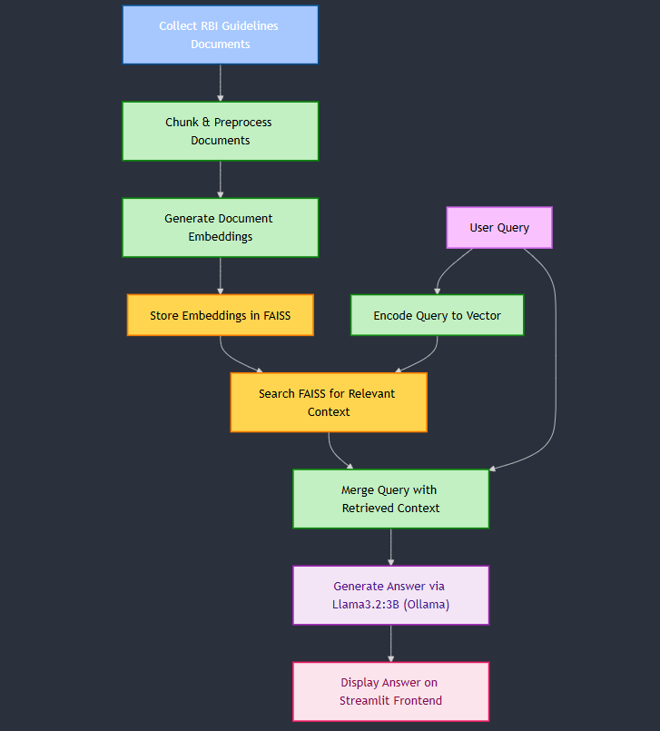
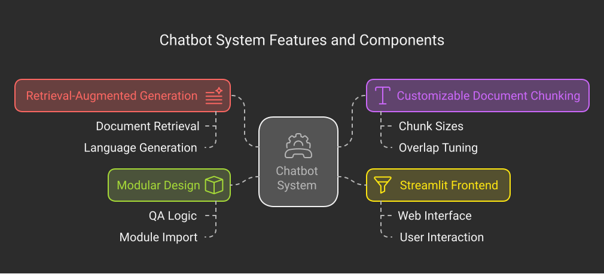

# RBI Financial & Operations Risk Guidelines — RAG Chatbot

A retrieval-augmented generation (RAG) system that answers questions about the Reserve Bank of India's Financial and Operations Risk guidelines. Answers are generated from the source documents rather than from model memory: relevant passages are retrieved from a FAISS vector index and passed to a locally hosted LLM, which returns a grounded, bullet-pointed response.

Retrieval quality is measured against a hand-labelled benchmark set rather than assessed by inspection — see [Evaluation](#evaluation).

Runs fully locally — no API keys, no data leaves the machine.

**Stack:** LangChain · FAISS · Ollama (`nomic-embed-text` + `llama3.2`) · Streamlit

---

## System Architecture

<p align="center">
  
</p>

<p align="center">
  
</p>

The pipeline has four stages:

1. **Ingestion** — RBI guideline documents are loaded and split into overlapping chunks.
2. **Indexing** — Chunks are embedded with `nomic-embed-text` and written to a local FAISS index (`financial_operations_risk_guidelines/`).
3. **Retrieval** — The question is embedded and matched against the index by cosine similarity, returning the top `k=5` chunks.
4. **Generation** — The retrieved chunks are concatenated into a context block and passed to `llama3.2` with a prompt that constrains it to answer from context only, and to decline when the context is insufficient.

---

## Why Retrieval Rather Than a Fine-Tuned or General-Purpose Model

Regulatory guidance is long, frequently revised, and only useful when tied back to the text it came from. Retrieval keeps answers anchored to the current source documents and makes it possible to update the corpus without retraining anything.

Running the model locally through Ollama means confidential or draft regulatory material can be indexed without sending it to a third-party API.

---

## Evaluation

Retrieval is scored against a hand-labelled benchmark set of **50 questions** drawn from the RBI Financial and Operations Risk guidelines. Each question is paired with the clause that contains its answer, identified by section number and source document, so a retrieval is counted correct only when the labelled clause appears in the returned chunks.

Two metrics are reported:

- **Recall@k** — the proportion of questions for which the correct clause appears anywhere in the top *k* retrieved chunks. This is the ceiling on answer quality: if the clause never reaches the model, no prompt can recover it.
- **MRR (Mean Reciprocal Rank)** — the average of `1/rank` of the first correct clause. This distinguishes a system that surfaces the right passage first from one that buries it at position five.

### Results

| Metric | Score |
| --- | ---: |
| Recall@1 | 68% |
| Recall@3 | 84% |
| Recall@5 | 90% |
| MRR | 0.76 |

### Chunking Ablation

Chunking strategy was the largest single lever on retrieval quality. The table below compares character-based splitting against splitting on the numbered clause hierarchy of the master directions, holding the embedding model, index, and `k` constant.

| Chunking strategy | Recall@5 | MRR |
| --- | ---: | ---: |
| Character-based (`chunk_size=1000`, `overlap=200`) | 74% | 0.59 |
| Clause-boundary, section ID retained as metadata | 90% | 0.76 |

RBI master directions are hierarchically numbered, and character-based splitting cuts across clause boundaries — separating a provision from its qualifying sub-clauses, which are frequently what the question is actually about. Splitting on the clause hierarchy keeps each provision intact and carries its section identifier through as metadata.

---

## Reproducing the Evaluation

```bash
python evaluate.py --benchmark benchmark.jsonl --k 5
```

benchmark.jsonl holds one record per question:

```json
{"question": "...", "source_document": "...", "section": "...", "notes": "..."}
```

The evaluation script reports Recall@k and MRR based on whether the labelled source clause appears in the retrieved results.

---

Limitations

The benchmark covers the Financial and Operations Risk guidelines only, and was labelled by a single annotator, so borderline judgements about which clause "contains" an answer are unreviewed.

Retrieval metrics bound answer quality but do not measure generation quality — whether the model faithfully uses a correctly retrieved clause is assessed separately by manual review of a sample.

---

Project Structure

```
.
├── frontend.py            # Streamlit interface
├── chatbot_backend.py     # get_answer() — retrieval + generation chain
├── RAG-project.ipynb      # Ingestion, chunking, and FAISS index construction
├── evaluate.py            # Recall@k and MRR scoring against the benchmark set
├── benchmark.jsonl        # Labelled question → source clause pairs
├── System_Arc.png         # Architecture diagram
├── RBI_Risk_Chatbot.svg   # Retrieval/generation flow diagram
├── requirements.txt       # Python dependencies
└── README.md
```

---

Setup

1. Clone and enter the repository
   ```bash
   git clone https://github.com/pkarthikeya1/QnA_RAG_Chatbot_RBI_Risk_Guidelines.git
   cd QnA_RAG_Chatbot_RBI_Risk_Guidelines
   ```
2. Create a virtual environment
   Python 3.9+ is required.
   ```bash
   python -m venv venv
   source venv/bin/activate      # Windows: venv\Scripts\activate
   ```
3. Install dependencies
   ```bash
   pip install -r requirements.txt
   ```
4. Start Ollama and pull both models
   The backend expects an Ollama server at 127.0.0.1:11434. Update base_url in chatbot_backend.py if yours differs.
   ```bash
   ollama serve
   ollama pull nomic-embed-text
   ollama pull llama3.2
   ```
5. Build the vector index
   The FAISS index is loaded from a local directory named financial_operations_risk_guidelines/, which is not committed to the repository.
   Run the ingestion cells in RAG-project.ipynb to build it from the source guideline documents before starting the app.

---

Running the Chatbot

```bash
streamlit run frontend.py
```

Enter a question, click Get Answer, and the system retrieves the relevant guideline passages and returns an answer in bullet points.

The backend can also be called directly:

```python
from chatbot_backend import get_answer

print(get_answer("What are the board's responsibilities in outsourcing of financial services?"))
```

---

Design Notes

Chunking

Retrieval quality is bounded by how the source documents are split.

Chunks that are too small lose the surrounding clause context; chunks that are too large dilute the embedding and crowd the model's context window.

The chunking ablation above measures the effect of the splitting strategy on retrieval performance.

Retrieval Depth

k=5 trades recall against context noise — a higher k is more likely to contain the correct passage, but gives the model more irrelevant text to reason around and consumes more of the context window.

The Recall@1, Recall@3, and Recall@5 results show that most of the retrieval gain is achieved by the first few results, with a further improvement when expanding retrieval to five chunks.

Grounding

The prompt instructs the model to answer from the retrieved context only and to decline when the context doesn't support an answer.

For regulatory questions, a refusal is a better outcome than a fluent guess.

---

Further Work

· Source citations in responses — return the originating section number and document alongside each answer, so responses can be traced back to the guideline text.
· Hybrid retrieval — combine lexical (BM25) and dense retrieval, since regulatory text depends heavily on exact terminology and circular references.
· Standalone ingestion script — extract index construction from the notebook into a reproducible CLI entry point.
· Reranking — add a reranking stage to improve the ordering of retrieved passages before they are passed to the LLM.
· Generation evaluation — introduce a separate benchmark for answer faithfulness, relevance, completeness, and citation accuracy.
· Automated evaluation in CI — run the retrieval benchmark automatically when changes are made to chunking, embeddings, or retrieval configuration.

---

License

MIT

```
